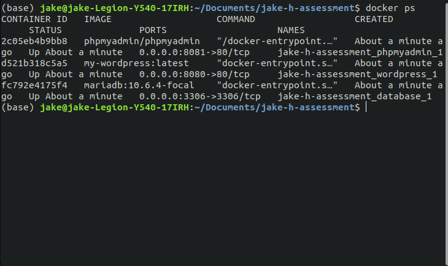
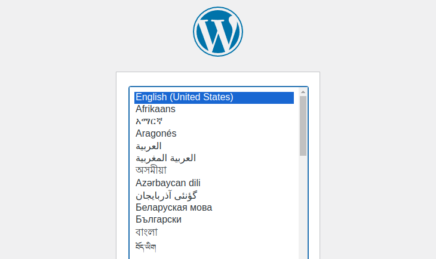
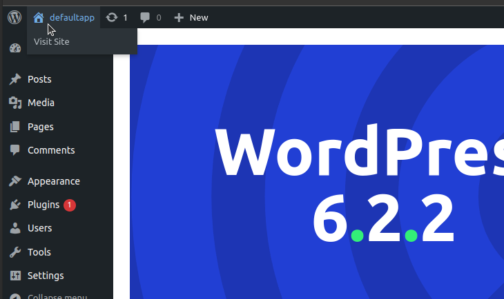
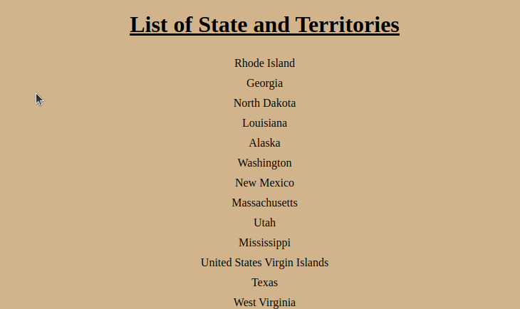

# jake-h-assessment


This is a simple Wordpress application that displays a list of all the US states and territories :us:



## Requirements :wrench:

In order to set up local development environment you will need the following:

- [Docker](https://docs.docker.com/get-started/)
- [Docker Compose](https://docs.docker.com/compose/install/)
- [PHP](https://www.php.net/manual/en/install.php)
- [Composer](https://getcomposer.org/)

## Getting Started :fire:

### 1. First make sure you have all the requirements above.

### 2. Clone this repo to your local 

### 3. We will install the required composer packages in our custom theme folder.
At the project level directory run this:

```
cd themes/main/
composer install
cd .. 
cd ..
```
You should now have a `/vendor` folder in `/themes/main`.

### 4. Define environment variables for docker.

Create a new file named `.env` in the project directory, 

```
touch .env
```
    
...and copy the contents from `.env.example` into to this new file.

```
cp .env.example .env
```
Feel free to change these custom variables if you'd like.

### 5. Start our docker containers.

Make sure you have docker running in the background.

In the main project directory run ...

```
docker-compose up -d 
```
or this to keep the log running in your terminal

```
docker-compose up 
\\ Ctrl + Z to close the log
```
If things fail, make sure you have no other docker container instances currently running, or have any applications running on the ports needed for the container: 8081, 8080, 3306 (Apache, Xampp, etc.)

You may need to shut down any processes that conflict, or move some things around

### 6. You should now have the Wordpress frontend running on port 8080

Visit [localhost:8080](http://localhost:8080/) and you should see this.



- choose a region
- pick a site title
- create your username
- create a password
- add an email
- click install
- you will be brought into the wp admin

If you forget the password and/or username, you'll lose admin access, and there is no recovery solution currently. But you'll still be able to see the build at the index page.

### 7. Click on the dropdown in top left corner, or just go [here](http://localhost:8080/)



This is the page with the desired functionality:



# Wrapping up :burrito:

To close the containers:

```
docker-compose down
```

## Notes :notebook:
 - This was built on Ubuntu/Linux
 - I used mariadb for compatibility reasons
 - I'm using the `cached_data.json` file to hold the `public.opendatasoft.com` data
 - `/mu_plugins` is being used to auto-assign the custom theme to  'main' during the install 
 - If you run into any problems you can contact me here: `howardjake9512@gmail.com`

 Thank you :dog: